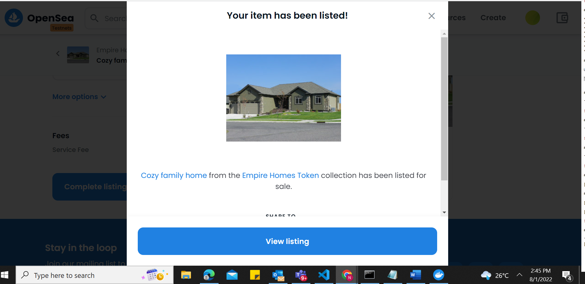
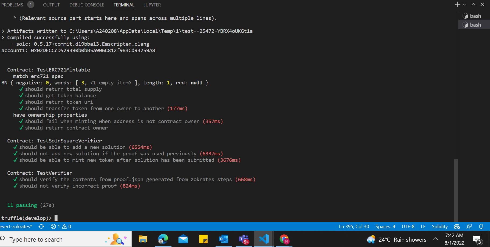

# Udacity Blockchain Capstone

This is the final project for the Udacity Blockchain Nanodegree program. The project involves minting tokens to represent property titles. zk-SNARKS are leveraged to create a system which can prove the ownership of the property title without revealing specific information of the property.

The tokens are minted and then placed on Opensea for sale or auctions.

# Project Resources

* [Remix - Solidity IDE](https://remix.ethereum.org/)
* [Visual Studio Code](https://code.visualstudio.com/)
* [Truffle Framework](https://truffleframework.com/)
* [Ganache - One Click Blockchain](https://truffleframework.com/ganache)
* [Open Zeppelin ](https://openzeppelin.org/)
* [Interactive zero knowledge 3-colorability demonstration](http://web.mit.edu/~ezyang/Public/graph/svg.html)
* [Docker](https://docs.docker.com/install/)
* [ZoKrates](https://github.com/Zokrates/ZoKrates)

# Zokrates
Install version `0.4.10` because the latest version produces a contract which doesn't conform to the examples shown during the course

`docker run -v /path/to/project/folder:/home/zokrates/code -ti zokrates/zokrates:0.4.10 /bin/bash`

## Generate New Proof
* Compute witness the witness
  ``` 
  ~/zokrates compute-witness -a 9 81
  ```

* Generate proof
  ```
  ~/zokrates generate-proof
  ```

* Export verifier
  ```  
  ~/zokrates export-verifier
  ```

# Deploy to Rinkeby
Create the following files in the ```eth-contracts``` folder:
* ```.infuraKey```: Your [Infura](https://infura.io/) key
* ```.secret```: Your [MetaMask](https://metamask.io/) seed phrase (mnemonic)

And store your infura key and metamask seed phrase in the files listed above.

Run the following command:
```truffle migrate --reset --network rinkeby ```

# Submit Zokrated Solution And Mint Token
Update ```config.json``` with the addresses for ```Verifier```, ```EmpireHomesERC721Token``` and ```SolnSquareVerifier```

Switch to the ```eth-contracts``` directory on the terminal

Run the following command (submits a new solution with the proof and the token ID provided as arguments):
```node submit-solution.js ../zokrates/code/square/proof.json 3```

Mint the token(mint the token specifying the token ID as an argument):
```node mint-token.js 3```

# OpenSea Deployed Tokens
* EmpireHomesERC721Token: [```0xD0bcD4021f7f8d7b011d5D75f2b43533bC026ea3```](https://rinkeby.etherscan.io/address/0xD0bcD4021f7f8d7b011d5D75f2b43533bC026ea3)
* Verifier: [```0xD088d2CD5A3232bC98B430ED1351Be66170C133C```](https://rinkeby.etherscan.io/address/0xD088d2CD5A3232bC98B430ED1351Be66170C133C)
* SolnSquareVerifier: [```0xc68D9FF0Ec4Da4687f2565F800F8b68afdaC2A25```](https://rinkeby.etherscan.io/address/0xc68D9FF0Ec4Da4687f2565F800F8b68afdaC2A25)




# Testing

To run truffle tests:
In the terminal run the command `truffle develop`

Then run:
`test`


## Versions

* Truffle v5.5.12 (core: 5.5.12)
* Ganache v^7.1.0
* Solidity - v0.5.16 (solc-js)
* Node v16.14.2
* Web3.js v1.5.3
